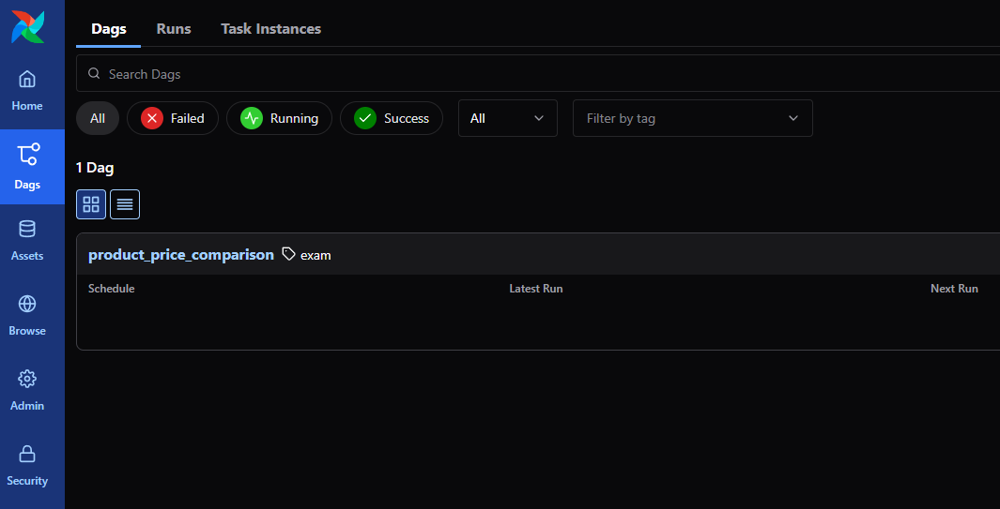
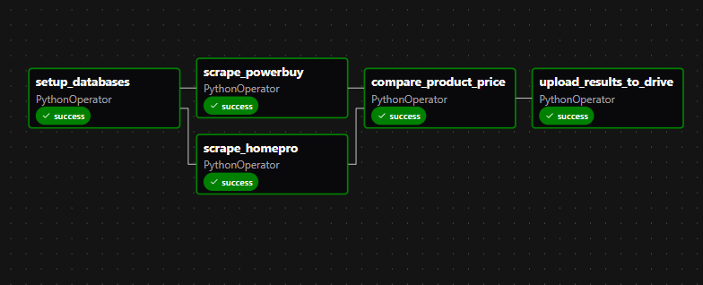

# Scrape TV data from Homepro and Powerbuy for price comparison

## Setup and Run Instructions

### 1. Build Airflow Image
```bash
docker build -t airflow-scraper .
```

### 2. Start Services
```bash
docker compose up -d
```

### 3. Run Pipeline
Access Airflow UI at http://localhost:8080 and trigger the scraping pipeline.



### 4. Check result
Open drive [link](https://drive.google.com/drive/folders/1SaBmZ-jwPOhIl2uKvyShdE7k_cYOaZ6I?usp=sharing) file name `compare_price.csv`

## Pipeline Description
### Objective

Compare Samsung TV prices between two major Thai retailers:
- [HomePro](https://www.homepro.co.th) - Using `requests` and `BeautifulSoup`
- [PowerBuy](https://www.powerbuy.co.th) - Using `selenium` to avoid Cloudfare block

The pipeline scrapes product data, matches identical models by product ID, and generates price comparison reports to help consumers find the best deals.

The product ID is extracted from scraped product name as they are essential for price comparison to compare price with the same product model

For example:
- Product Name: `THE FRAME TV 75” SAMSUNG (4K, SMART TV) QA75LS03DAKXXT`
- Product ID: `QA75LS03DAKXXT`

## Pipeline Overview


The data pipeline consists of five stages:

1. **setup_database** - Initialize DuckDB database and create tables
2. **scrape_homepro** - Scrape Samsung TV data from HomePro website
3. **scrape_powerbuy** - Scrape Samsung TV data from PowerBuy website  
4. **compare_product_price** - Compare prices between websites and generate comparison report
5. **upload_result_to_drive** - Upload comparison results to Google Drive

This pipeline showcases my skills:

1. **Tech Stack Design** - Selected appropriate tools for each component:
   - Apache Airflow for orchestration
   - DuckDB for lightweight analytics database
   - Docker for containerization
   - Google Drive API for result sharing

2. **Advanced Scraping Techniques**:
   - **Basic scraping** with `requests` + `BeautifulSoup` for HomePro
   - **Advanced scraping** with `Selenium` to bypass Cloudflare protection for PowerBuy
   - Product matching using regex patterns for Samsung model IDs

3. **Pipeline Logic & Architecture**:
   - Parallel scraping tasks for efficiency
   - Data normalization and deduplication
   - Price comparison using SQL pivot operations
   - Automated result delivery to cloud storage
4. **Coding**:
   - The code is group into functions and classes to organize and readability


**Key Files in this repo:**
- `helper.py` - Contains `BaseScraping`, `HomeProProductScraping`, `PowerBuyProductScraping` classes and utility functions
- `pipeline.py` - Defines the Airflow DAG with task dependencies
- `docker-compose.yaml` - Orchestrates Airflow services (webserver, scheduler, database)

## Future Improvements

1. **Enhanced Product Identification**: As this repo shows only **Samsung TV case**, the **process to identify product similarity** can be improve.
   - Implement fuzzy matching algorithms for better product correlation
   - Add machine learning models to identify similar products across different naming conventions
   - Include product specifications matching (screen size, resolution, features)

2. **Better Code Structure**: As for tight development schedule, the improvement in code structure can be made for example.
   - Split `helper.py` into modular files:
     - `scrape.py` - Scraping classes and web automation
     - `google.py` - Google Drive API operations
     - `duckdb.py` - Database operations and queries
     - `utils.py` - Utility functions and data processing

3. **Dynamic DAG Generation**: **Not implemented in this repo as focus was on demonstrating core pipeline design and coding skills**
   - Implement Airflow framework to auto-generate DAGs from configuration files
   - Support multiple retailer configurations without code changes
   - Enable dynamic task creation based on product categories
